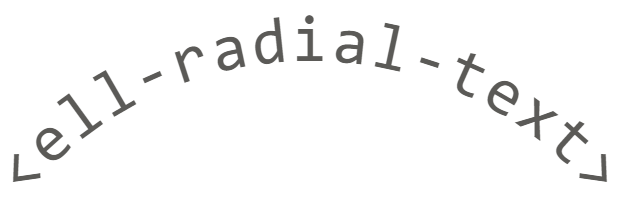

<!--
  Title: ell-radial-text
  Description: A Web Component to curve text around a circle
  Author: e111077
  -->
# <ell-radial-text&gt;


A simple webcomponent that wraps text around a circle.

## Examples

The image above can be set up like so:

```html
<script type="module">
  // will require resolving
  import 'ell-radial-text';
</script>
<ell-radial-text
    text="<ell-radial-text>"
    radius="172"
    step="6"
    center-direction="UP">
</ell-radial-text>
```

## API

### Props

| Property          | Attribute          | Type               | Default  | Description |
| ----------------- | ------------------ | ------------------ | -------- | ----------- |
| `text`            | `text`             | `string`           | `''`     | The text to be wrapped. |
| `radius`          | `radius`           | `number`           | `0`      | The radius of the circle in pixels. |
| `step`            | `step`             | `number`           | `0`      | The radial step between characters in degrees (**NOTE:** This is overriden by `autoStep`). |
| `start`           | `start`            | `number`           | `0`      | The start position of the text in degrees where `0` is the point at cooridnate `(0, radius)` and positive is clockwise (**NOTE:** This is overriden by `centerDirection`). |
| `autoStep`        | `auto-step`        | `boolean`          | `false`  | Will wrap the text all the way around the circle by automatically calculating step (**NOTE:** overrides `step` value). |
| `centerDirection` | `center-direction` | `CenterDirection`* | `'AUTO'` | Will center your text around the given direction (**NOTE:** overrides `start` value). |

\* `CenterDirection` is equal to type
`'UP' | 'DOWN' | 'LEFT' | 'RIGHT' | 'AUTO'` and is exported by the main file.

### Styling

| Custom Property     | Default     | Description |
| ------------------- | ----------- | ----------- |
| `--ell-font-family` | `monospace` | The font-family of the text |

**It is HIGHLY recommended to use a monospace font-face.**

This component renders the text inside the Shadow DOM, but common properties
cascade though Shadow DOM regardless such as `font` and `color`. Though,
`font-family` is explicitly defined on this component and can be overridden with
a css selector that is specific to this component or via a custom property e.g.

```css
ell-radial-text, .radialText, #radialText /* etc */ {
  font-family: 'Apercu Mono', Monaco, monospace;
}

/* for global or imprecise styling you can use CSS Custom Properties */
body {
  --ell-font-family: 'Apercu Mono', Monaco, monospace;
}
```